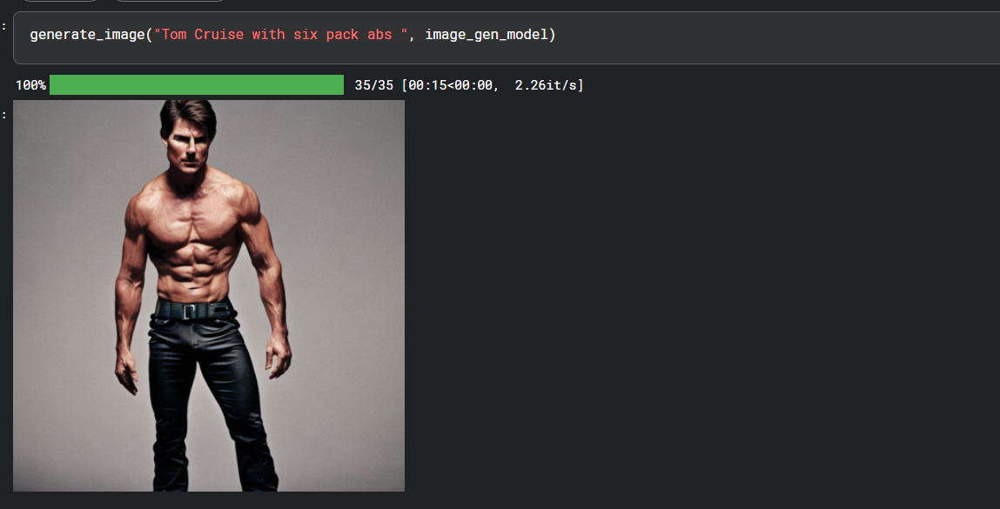
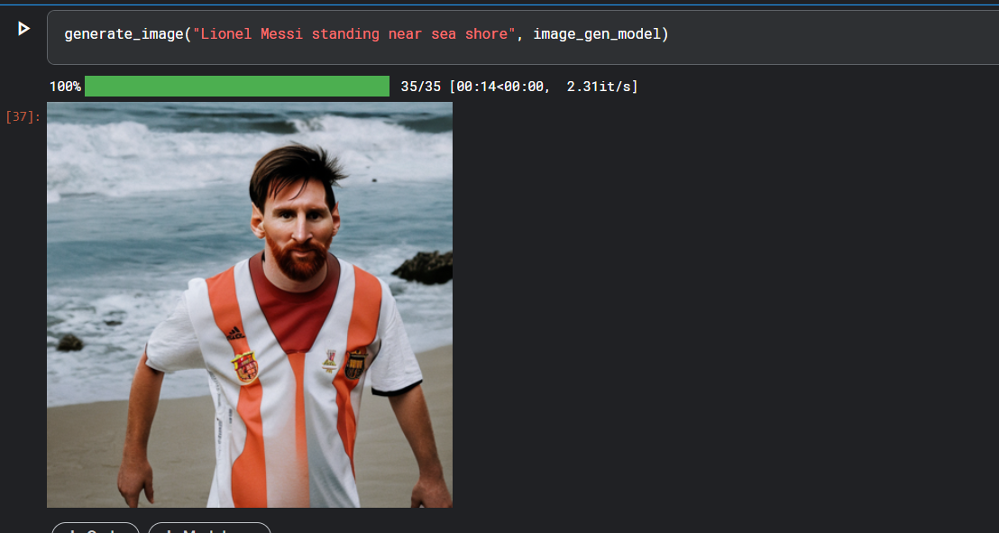

# Text-to-image-generator
This project generates AI-driven images using Stable Diffusion and GPT-2 for creative text-to-image synthesis.

This project demonstrates a pipeline for generating AI-generated images using the Stable Diffusion model along with components from Hugging Face's Transformers library. It includes a configuration class (CFG) to manage parameters such as the device (GPU/CPU), random seed, model IDs, image generation steps, and guidance scale.

The Stable Diffusion model is loaded from the Hugging Face repository using the StableDiffusionPipeline, which generates high-quality images based on textual prompts. The project also integrates a GPT-2 language model for prompt generation, enabling the creation of diverse image prompts.

Key steps include downloading and setting up pre-trained models, initializing the image generation pipeline on a CUDA device (if available), and configuring generation parameters like image size, guidance scale, and inference steps. A custom function generate_image() accepts a prompt and returns an AI-generated image, resized to the desired dimensions.

Additional optimizations, such as low memory usage via the accelerate library, are suggested for enhanced performance. The project is ideal for exploring AI-driven creativity by generating custom images from natural language descriptions.

Author : Kaustubh Sahu

Email : kaustubhkanha@gmail.com

